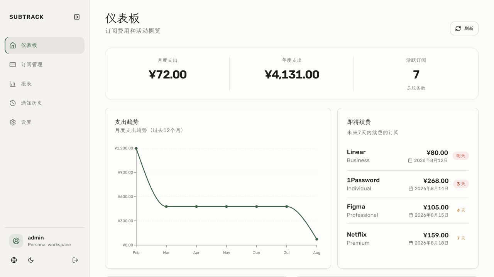

# SubTrack

<p align="center">
  <strong>A clean, modern, local-first subscription and expense tracker.</strong>
</p>

<p align="center">
  Manage recurring subscriptions, renewals, payment history, expense reports, and notifications with data stored in your own SQLite database.
</p>

<p align="center">
  <a href="https://github.com/aoomee/SubTrack/actions/workflows/ci.yml"></a>
  <a href="https://github.com/aoomee/SubTrack/actions/workflows/docker-build.yml"></a>
  <a href="https://github.com/aoomee/SubTrack/pkgs/container/subtrack"></a>
  <a href="LICENSE"></a>
</p>

<p align="center"><a href="README.md">简体中文</a></p>



## Highlights

- Subscription lifecycle and payment history management
- Monthly, quarterly, and yearly expense reports
- Nine currencies with optional automatic exchange-rate updates
- Telegram and email notifications
- CSV and JSON import/export
- Chinese and English interfaces with light and dark themes
- Local SQLite storage and multi-architecture Docker images

## One-command VPS installation

Run as `root` on a Linux VPS:

```bash
curl -fsSL https://raw.githubusercontent.com/aoomee/SubTrack/main/scripts/install-vps.sh | bash
```

The installer pulls `ghcr.io/aoomee/subtrack:latest`, creates persistent storage, and prints the administrator credentials when it finishes. Open `http://YOUR_SERVER_IP:3001` after deployment.

## Docker Compose

Copy the complete, annotated Compose example from the [Chinese project homepage](README.md#-docker-compose), replace the required `CHANGE_ME` placeholders, then run:

```bash
docker compose pull
docker compose up -d
```

For 1Panel or another reverse proxy, use [docker-compose.1panel.yml](docker-compose.1panel.yml) and bind the service to `127.0.0.1`.

## Container image

[`ghcr.io/aoomee/subtrack`](https://github.com/aoomee/SubTrack/pkgs/container/subtrack) supports `linux/amd64` and `linux/arm64`.

| Tag | Purpose |
| --- | --- |
| `latest` | Latest stable build from the default branch |
| `main` | Latest build from `main` |
| `sha-xxxxxxx` | Immutable build for a specific Git commit |
| `v*` | Build for a Git release tag |

## Documentation

- [Production environment example](.env.production.example)
- [Deployment guide](docs/DEPLOYMENT.zh-CN.md)
- [Authentication and security](docs/AUTHENTICATION.md)
- [Notification system](docs/NOTIFICATION_SYSTEM.md)
- [API documentation](docs/API_DOCUMENTATION.md)

## License

SubTrack continues the MIT-licensed [huhusmang/Subscription-Management](https://github.com/huhusmang/Subscription-Management) project and is released under the [MIT License](LICENSE).
