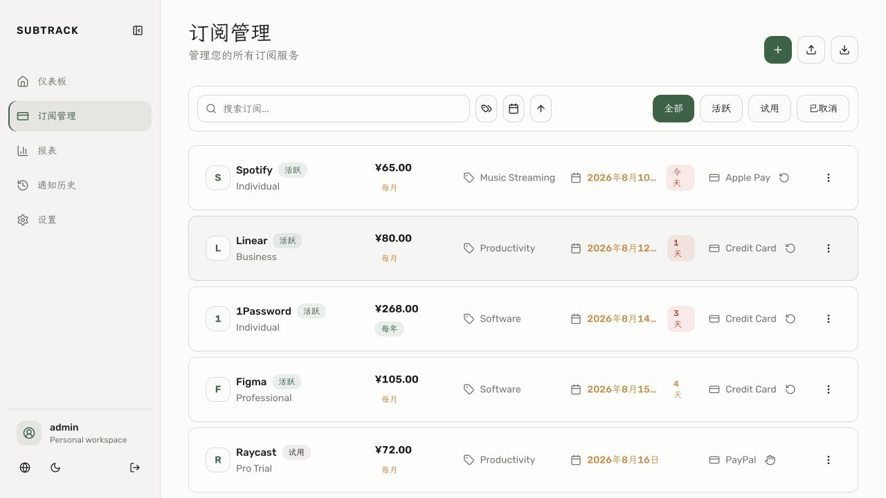
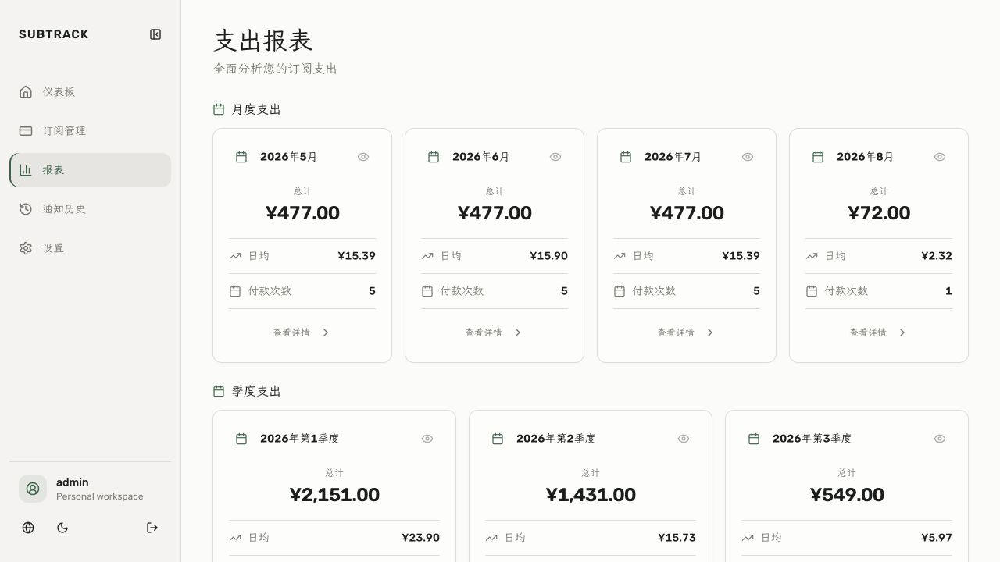

# SubTrack

<p align="center">
  <strong>简洁、现代、本地优先的订阅管理与支出追踪工具</strong>
</p>

<p align="center">
  管理周期订阅、续费日期、支付历史、支出报表与通知提醒。数据保存在你自己的 SQLite 数据库中。
</p>

<p align="center">
  <a href="https://github.com/aoomee/SubTrack/actions/workflows/ci.yml"></a>
  <a href="https://github.com/aoomee/SubTrack/actions/workflows/docker-build.yml"></a>
  <a href="https://github.com/aoomee/SubTrack/pkgs/container/subtrack"></a>
  <a href="LICENSE"></a>
</p>

<p align="center">
  <a href="#-一键部署">一键部署</a> ·
  <a href="#-docker-compose">Docker Compose</a> ·
  <a href="#-镜像标签">镜像标签</a> ·
  <a href="README.en.md">English</a>
</p>


## ✨ 界面预览

### 订阅管理



### 支出报表



## 功能

| 订阅与支付 | 分析与提醒 | 使用体验 |
| --- | --- | --- |
| 订阅增删改查 | 月度、季度、年度报表 | 中英文界面 |
| 自动与手动续费 | 分类与支付方式统计 | 浅色、深色与系统主题 |
| 支付历史追踪 | Telegram、邮件通知 | 桌面端与移动端适配 |
| CSV / JSON 导入导出 | 九种常用货币与汇率更新 | SQLite 本地数据存储 |

## 🚀 一键部署

适用于已取得 `root` 权限的 Linux VPS。脚本会自动安装 Docker（如未安装）、拉取最新镜像、创建数据卷，并在结束时显示登录账号和密码。

```bash
curl -fsSL https://raw.githubusercontent.com/aoomee/SubTrack/main/scripts/install-vps.sh | bash
```

部署完成后访问：

```text
http://你的服务器IP:3001
```

自定义端口（示例：8080）：

```bash
curl -fsSL https://raw.githubusercontent.com/aoomee/SubTrack/main/scripts/install-vps.sh | env SUBTRACK_HOST_PORT=8080 bash
```

> 再次执行同一条脚本即可更新镜像。已有 `.env`、管理员密码和 `subtrack-data` 数据卷会被保留。

## 🐳 Docker Compose

下面是可直接复制的完整配置。GitHub 代码块右上角提供一键复制按钮；启动前只需替换两个标有 `CHANGE_ME` 的必填值。

```yaml
services:
  subtrack:
    image: ghcr.io/aoomee/subtrack:latest
    pull_policy: always
    container_name: subtrack
    restart: unless-stopped

    environment:
      NODE_ENV: production
      PORT: "3001"
      DATABASE_PATH: /app/data/database.sqlite

      # 必填：请替换为随机长字符串，可用 openssl rand -base64 48 生成
      SESSION_SECRET: "CHANGE_ME_TO_A_LONG_RANDOM_STRING"

      # 必填：管理员登录信息
      ADMIN_USERNAME: "admin"
      ADMIN_PASSWORD: "CHANGE_ME_TO_A_STRONG_PASSWORD"

      # 基础设置
      BASE_CURRENCY: "CNY"
      SCHEDULER_TIMEZONE: "Asia/Shanghai"
      SCHEDULER_CHECK_TIME: "09:00"
      TRUST_PROXY: "1"
      SESSION_COOKIE_SECURE: "auto"
      SESSION_COOKIE_SAMESITE: "lax"

      # 可选：需要通知或实时汇率时取消注释并替换占位符
      # TIANAPI_KEY: "YOUR_TIANAPI_KEY"
      # TELEGRAM_BOT_TOKEN: "YOUR_TELEGRAM_BOT_TOKEN"
      # EMAIL_HOST: "smtp.example.com"
      # EMAIL_PORT: "587"
      # EMAIL_SECURE: "false"
      # EMAIL_USER: "YOUR_SMTP_USERNAME"
      # EMAIL_PASSWORD: "YOUR_SMTP_PASSWORD"
      # EMAIL_FROM: "SubTrack <no-reply@example.com>"

    ports:
      - "3001:3001"

    volumes:
      - subtrack-data:/app/data

    healthcheck:
      test: ["CMD", "node", "-e", "const http=require('http');const req=http.request({hostname:'localhost',port:3001,path:'/api/health',timeout:2000},res=>process.exit(res.statusCode===200||res.statusCode===401?0:1));req.on('error',()=>process.exit(1));req.end();"]
      interval: 30s
      timeout: 3s
      start_period: 15s
      retries: 3

volumes:
  subtrack-data:
    name: subtrack-data
```

保存为 `docker-compose.yml` 后启动：

```bash
docker compose pull
docker compose up -d
```

### 1Panel / 本地端口模式

如果通过 1Panel 反向代理访问，建议不要把应用端口直接暴露到公网。将上面 Compose 中的端口映射替换为：

```yaml
ports:
  - "127.0.0.1:3001:3001"
```

仓库也提供了专用文件：[docker-compose.1panel.yml](docker-compose.1panel.yml)。在 1Panel 的环境变量中至少设置：

```dotenv
SESSION_SECRET=CHANGE_ME_TO_A_LONG_RANDOM_STRING
ADMIN_USERNAME=admin
ADMIN_PASSWORD=CHANGE_ME_TO_A_STRONG_PASSWORD
```

## 🏷️ 镜像标签

镜像地址：[`ghcr.io/aoomee/subtrack`](https://github.com/aoomee/SubTrack/pkgs/container/subtrack)

| 标签 | 用途 |
| --- | --- |
| `latest` | 最新稳定版，跟随默认分支，推荐日常部署 |
| `main` | `main` 分支的最新构建 |
| `sha-xxxxxxx` | 固定到某次 Git 提交，适合需要可复现版本的部署 |
| `v*` | Git 版本标签对应的发布镜像 |

支持 `linux/amd64` 与 `linux/arm64`。

## 常用命令

```bash
# 查看运行状态
docker compose ps

# 查看日志
docker compose logs -f --tail=100

# 更新到最新版
docker compose pull && docker compose up -d

# 停止服务（不会删除数据卷）
docker compose down
```

> 请勿执行 `docker compose down -v`，其中的 `-v` 会删除保存订阅数据的卷。

## 配置与文档

- [生产环境变量示例](.env.production.example)
- [部署说明](docs/DEPLOYMENT.zh-CN.md)
- [认证与安全](docs/AUTHENTICATION.md)
- [通知系统](docs/NOTIFICATION_SYSTEM.md)
- [API 文档](docs/API_DOCUMENTATION.md)

## 本地开发

需要 Node.js 20+。

```bash
npm install
npm run dev
```

另开一个终端启动后端：

```bash
cd server
npm install
npm run db:init
npm start
```

- 前端：http://localhost:5173
- 后端：http://localhost:3001/api

## License

SubTrack 基于 MIT 许可的 [huhusmang/Subscription-Management](https://github.com/huhusmang/Subscription-Management) 项目继续开发。

本项目采用 [MIT License](LICENSE)。
